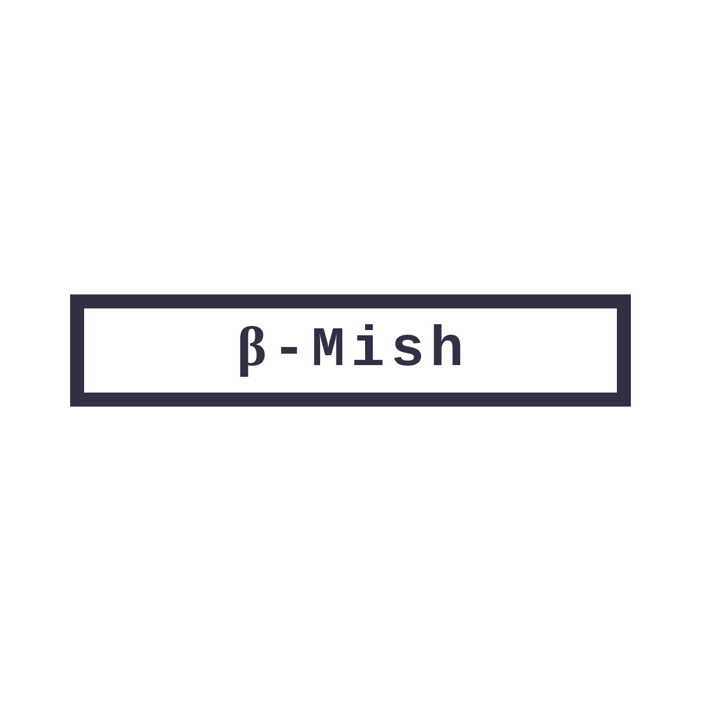
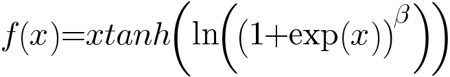
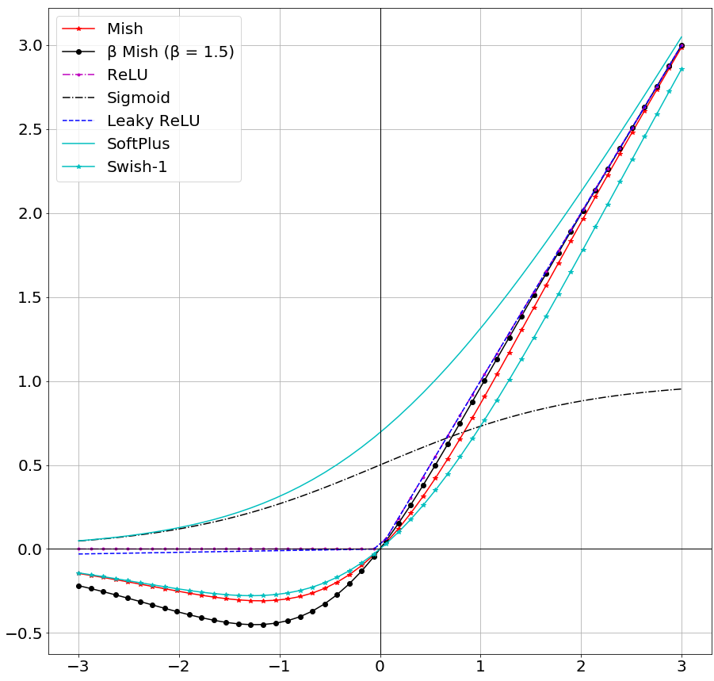
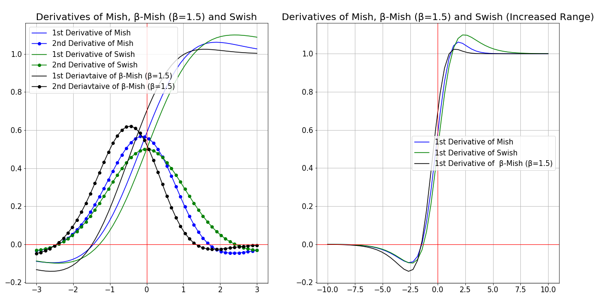
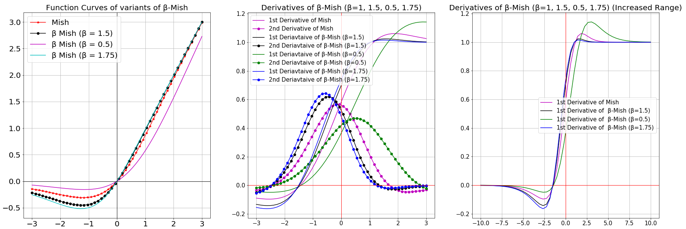

  

# β-Mish

If β=1.5, the function ranges from: ≈-0.451103 to ∞.

## Results

### CIFAR-10:

### ResNet v1:

#### ResNet-20:

|Activation Function| Top-1 Accuracy| Loss|
|---|---|---|
|Mish|91.81%|4.47284%|
|Swish-1|**91.95%**|**4.440651%**|
|ReLU|91.5%|4.94356%|
|β-Mish (β = 1.5)|91.75%|4.4894%|

### ResNet v2:

#### ResNet-20:

|Activation Function|Testing Top-1 Accuracy|Testing Loss|
|---|---|---|
|Aria-2(β = 1, α=1.5)|91.73%|4.25074%|
|Bent's Identity|89.1%|4.52398%|
|ELU(α=1.0)|91.58%|**4.05194%**|
|Hard Sigmoid|87.42%|4.86469%|
|Leaky ReLU(α=0.3)|90.57%|4.093131%|
|Mish|92.02%|4.19176%|
|PReLU(Default Parameters)|91.25%|4.403224%|
|ReLU|91.71%|4.08291%|
|SELU|90.59%|4.36311%|
|Sigmoid|89.27%|4.474636%|
|SoftPlus|91.39%|4.2238%|
|SoftSign|90.45%|4.402751%|
|Swish-1|91.61%|4.295542%|
|TanH|90.99%|4.3992%|
|Thresholded ReLU(θ=1.0)|76.22%|7.37498%|
|β-Mish (β=1.5)|**92.15%**|4.18306%|

#### Inception-ResNet v2:

|Activation Function |Testing Top-1 Accuracy|Testing Top-3 Accuracy|Testing Top-5 Accuracy|Testing Loss|
|---|---|---|---|---|
|Mish|**85.21%**|97.13%|99.22%|4.6409%|
|Swish-1|84.96%|97.29%|99.29%|4.8955%|
|ELU(α=1.0)|83.93%|96.96%|99.11%|4.884%|
|ReLU|82.22%|95.87%|98.65%|5.3729%|
|Leaky ReLU(α=0.3)|84.67%|**97.35%**|**99.42%**|**4.5577%**|
|TanH|76.29%|94.65%|98.42%|6.7464%|
|PReLU(Default Parameters)|81.99%|96.01%|99.04%|5.50853%|
|SELU|83.27%|96.61%|99.04%|5.1101%|
|Softsign|79.76%|95.15%|98.61%|6.0377%|
|β-Mish (β=1.5)|84.83%|97.19%|99.35%|4.8412%|

#### Capsule Network:

|Activation Function |Testing Top-1 Accuracy|Testing Top-3 Accuracy|Testing Top-5 Accuracy|Testing Loss (Margin Loss)|
|---|---|---|---|---|
|ELU(α=1.0)|71.7%|90.72%|95.85%|2.3819%|
|Mish|83.15%|94.62%|97.2%|1.51671%|
|Swish-1|82.48%|94.7%|97.11%|1.5232%|
|ReLU|82.19%|94.88%|97.48%|1.51009%|
|SELU|80.24%|94.3%|97.56%|1.9122%|
|Leaky ReLU(α=0.3)|**83.42%**|**95.48%**|**97.96%**|1.5393%|
|β Mish (β=1.5)|83.15%|94.98%|97.5%|**1.4803%**|
